**РОССИЙСКИЙ УНИВЕРСИТЕТ ДРУЖБЫ НАРОДОВ
ИМЕНИ ПАТРИСА ЛУМУМБЫ**

**Факультет физико-математических и естественных наук**

**Кафедра прикладной информатики и теории вероятностей**

**ОТЧЕТ** 

**ПО ЛАБОРАТОРНОЙ РАБОТЕ № 	10**

*дисциплина: Операционные системы*		

Студент: Благова Полина 

`	`Группа: НПМбв-19

**МОСКВА**

2023г.

**Цель работы:**

Познакомиться с операционной системой Linux. Получить практические навыки работы с редактором Emacs.

**Описание результатов выполнения задания:**

1\. Открыть emacs. Открываю редактор Emacs с помощью команды «emacs &»

2\. Создать файл lab07.sh с помощью комбинации Ctrl-x Ctrl-f (C-x C-f). 

3\. Наберите текст: 

#!/bin/bash

` `HELL=Hello

` `function hello {

` `LOCAL HELLO=World

` `echo $HELLO 

}

` `echo $HELLO 

hello 

4\. Сохранить файл с помощью комбинации Ctrl-x Ctrl-s (C-x C-s). 

5\. Проделать с текстом стандартные процедуры редактирования, каждое действие должно осуществляться комбинацией клавиш. 

5\.1. Вырезать одной командой целую строку (С-k). 

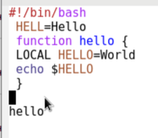

5\.2. Вставить эту строку в конец файла (C-y). 

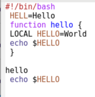

5\.3. Выделить область текста (C-space). 

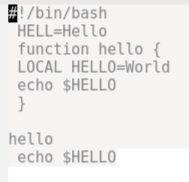

5\.4. Скопировать область в буфер обмена (M-w). 

5\.5. Вставить область в конец файла. 

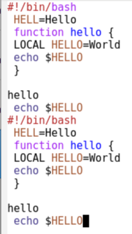

5\.6. Вновь выделить эту область и на этот раз вырезать её (C-w). 

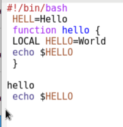

5\.7. Отмените последнее действие (C-/). 

6\. Научитесь использовать команды по перемещению курсора. 

6\.1. Переместите курсор в начало строки (C-a). 

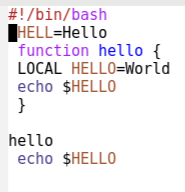

6\.2. Переместите курсор в конец строки (C-e).

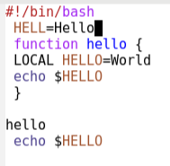

` `6.3. Переместите курсор в начало буфера (M-<). 

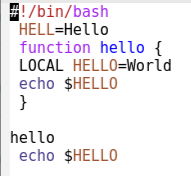

6\.4. Переместите курсор в конец буфера (M->). 

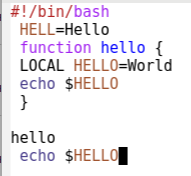

7\. Управление буферами. 7.1. Вывести список активных буферов на экран (C-x C-b). 

7\.2. Переместитесь во вновь открытое окно (C-x) o со списком открытых буферов и переключитесь на другой буфер. 

7\.3. Закройте это окно (C-x 0). 

7\.4. Теперь вновь переключайтесь между буферами, но уже без вывода их списка на экран (C-x b). 

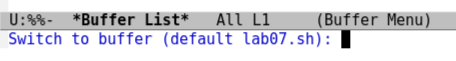

8\. Управление окнами. 

8\.1. Поделите фрейм на 4 части: разделите фрейм на два окна по вертикали (C-x 3), а затем каждое из этих окон на две части по горизонтали (C-x 2) 

8\.2. В каждом из четырёх созданных окон откройте новый буфер (файл) и введите несколько строк текста. Для этого предварительно создадаю эти файлы с помощью команд «touch ex1.txt», «touch ex2.txt», «touch ex3.txt», «touch ex4.txt»  

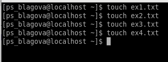

` `9. Режим поиска 

9\.1. Переключитесь в режим поиска (C-s) и найдите несколько слов, присутствующих в тексте. 

9\.2. Переключайтесь между результатами поиска, нажимая C-s. 

9\.3. Выйдите из режима поиска, нажав C-g.

` `9.4. Перейдите в режим поиска и замены (M-%), введите текст, который следует найти и заменить, нажмите Enter , затем введите текст для замены. После того как будут подсвечены результаты поиска, нажмите ! для подтверждения замены. 

9\.5. Испробуйте другой режим поиска, нажав M-s o. Объясните, чем он отличается от обычного режима?

Необходимо сначала ввести слово, потом нажать tab и только тогда будет выведено нужное слово.

**Вывод:**

Было ознакомление с операционной системой Linux. Получены практические навыки работы с редактором Emacs.

**Контрольные вопросы:**

1. **Кратко охарактеризуйте редактор emacs.** 

Emacs — интегрированная среда для выполнения большого количества типов задач. Это значит, что все инструменты редактирования, поиска, обработки текста, работы с файлами, доступны вам в любой момент независимо от того что вы делаете: пишете код или текст диссертации, читаете документацию, выполняете системные задачи, составляете своё расписание или пишете электронное письмо.

1. **Какие особенности данного редактора могут сделать его сложным для освоения новичком?** 

Основную трудность для новичков при освоении данного редактора могут составлять большое количество команд, комбинаций клавиш, которые не получится все запомнить с первого раза и поэтоу придется часто обращаться к справочным материалам.

1. **Своими словами опишите, что такое буфер и окно в терминологии emacs’а.** 

Буфер — объект, представляющий какой-либо текст. Буфер может содержать что угодно, например, результаты компиляции программы или встроенные подсказки. Практически всё взаимодействие с пользователем, в том числе интерактивное, происходит посредством буферов.
Окно — прямоугольная область фрейма, отображающая один из буферов. Каждое окно имеет свою строку состояния, в которой выводится следующая информация: название буфера, его основной режим, изменялся ли текст буфера и как далеко вниз по буферу расположен курсор.

1. **Можно ли открыть больше 10 буферов в одном окне?** 

Да

1. **Какие буферы создаются по умолчанию при запуске emacs?** 

При запуске Emacs по умолчанию создаются следующие буферы:

- «scratch» (буфер для несохраненного текста)
- «Messages» (журнал ошибок, включающий также информацию, которая появляется в области EchoArea)
- «GNU Emacs» (справочный буфер о редакторе)

1. **Какие клавиши вы нажмёте, чтобы ввести следующую комбинацию C-c | и C-c C-|?** 

– C-c — префикс вызова функций, зависящих от используемого режима

C-c | сначала, удерживая «ctrl», нажимаю «c», после – отпускаю обе клавиши и нажимаю «|» C-c C-| сначала, удерживая «ctrl», нажимаю «с», после – отпускаю обе клавиши и, удерживая «ctrl», нажимаю «|»

1. **Как поделить текущее окно на две части?** 

Чтобы поделить окно на две части необходимо воспользоваться комбинацией «Ctrl-x 3» (по вертикали) или «Ctrl-x 2» (по горизонтали).

1. **В каком файле хранятся настройки редактора emacs?** 

Настройки emacs хранятся в файле .emacs, который хранится в домашней дирректории пользователя. Кроме этого файла есть ещё папка .emacs.d, где хранятся дополнительные файлы настроек, подключаемые модули, временные файлы emacs и т.п.

1. **Какую функцию выполняет клавиша и можно ли её переназначить?** 

По умолчанию клавиша «←» удаляет символ перед курсором, но в редакторе её можно переназначить. Для этого необхдимо изменить конфигурацию файла .emacs.

1. ` `**Какой редактор вам показался удобнее в работе vi или emacs? Поясните почему**

Более удобным мне показался редактор emacs, потому что в нем проще открывать другие файлы, можно использовать сразу несколько окон, нет режимов для команд, которые являются немного непривычными.

