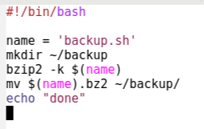
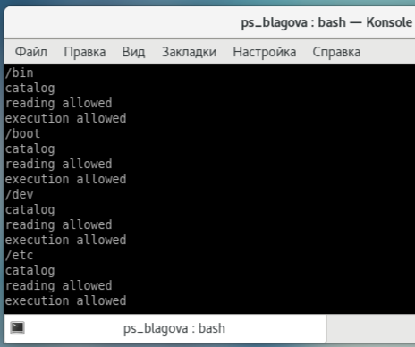

**РОССИЙСКИЙ УНИВЕРСИТЕТ ДРУЖБЫ НАРОДОВ
ИМЕНИ ПАТРИСА ЛУМУМБЫ**

**Факультет физико-математических и естественных наук**

**Кафедра прикладной информатики и теории вероятностей**

**ОТЧЕТ** 

**ПО ЛАБОРАТОРНОЙ РАБОТЕ № 	11**

*дисциплина: Операционные системы*		

Студент: Благова Полина 

`	`Группа: НПМбв-19

**МОСКВА**

2023г.

**Цель работы:**

Изучить основы программирования в оболочке ОС UNIX/Linux. Научиться писать небольшие командные файлы.

**Описание результатов выполнения задания:**

1\. Написать скрипт, который при запуске будет делать резервную копию самого себя (то есть файла, в котором содержится его исходный код) в другую директорию backup в вашем домашнем каталоге. При этом файл должен архивироваться одним из архиваторов на выбор zip, bzip2 или tar. Способ использования команд архивации необходимо узнать, изучив справку. 

Сначала изучаю справку для выбора способа архивации. Начинаю с zip

Командой “man zip” вывожу справку (на рисунке ниже)

Командой “man bzip2” вывожу справку (на рисунке ниже) 

Командой “man tar” вывожу последнюю справку (на рисунке ниже)

Скрипт, который при запуске будет делать копию самого себя.

2\. Написать пример командного файла, обрабатывающего любое произвольное число аргументов командной строки, в том числе превышающее десять. Например, скрипт может последовательно распечатывать значения всех переданных аргументов. 

Пример командного файла, обрабатывающего любое произвольное число аргументов командной строки, в том числе превышающие десять (на рисунке ниже)

Ниже пример того как скрипт распечатывает значения всех аргументов.

3\. Написать командный файл — аналог команды ls (без использования самой этой команды и команды dir). Требуется, чтобы он выдавал информацию о нужном каталоге и выводил информацию о возможностях доступа к файлам этого каталога.  

Нижу представлен скриншот командного файла - аналога команды ls.

Запускаю командный файл (рис ниже)

Он выдает информацию о возможностях доступа к файлам этого каталога. (рис ниже)

4\. Написать командный файл, который получает в качестве аргумента командной строки формат файла (.txt, .doc, .jpg, .pdf и т.д.) и вычисляет количество таких файлов в указанной директории. Путь к директории также передаётся в виде аргумента командной строки.

Пишу командный файл, который получает в качестве аргумента командной строки формат файла. (рис ниже)

Проверяю работу написанного скрипта (команда «./file4.sh ~ pdf sh txt doc»), предварительно добавив для него право на выполнение (команда «chmod +x \*.sh»)

(на рисунке ниже)

**Вывод:**

Были изучены основы программирования в оболочке ОС UNIX/Linux. Были написаны небольшие командные файлы.

**Контрольные вопросы:**

1. **Объясните понятие командной оболочки. Приведите примеры командных оболочек. Чем они отличаются?** 

Командная оболочка Unix — командный интерпретатор, используемый в операционных системах семейства Unix, в котором пользователь может либо давать команды операционной системе по отдельности, либо запускать скрипты, состоящие из списка команд. В первую очередь, под shell понимаются POSIX-совместимые оболочки, восходящие к Bourne shell (шелл Борна), появившемуся в Unix Version 7.

1. **Что такое POSIX?** 

POSIX (англ. Portable Operating System Interface — переносимый интерфейс операционных систем) — набор стандартов, описывающих интерфейсы между операционной системой и прикладной программой (системный API), библиотеку языка C и набор приложений и их интерфейсов.

1. **Как определяются переменные и массивы в языке программирования bash?** 

Командный процессор bash обеспечивает возможность использования переменных типа строка символов. Имена переменных могут быть выбраны пользователем. Пользователь имеет возможность присвоить переменной значение некоторой строки символов. Например, команда «mark=/usr/andy/bin» присваивает значение строки символов /usr/andy/bin переменной mark типа строка символов. Значение, присвоенное некоторой переменной, может быть впоследствии использовано. Для этого в соответствующем месте командной строки должно быть употреблено имя этой переменной, которому предшествует метасимвол $. Например, команда «mv afile ${mark}» переместит файл afile из текущего каталога в каталог с абсолютным полным именем /usr/andy/bin. Оболочка bash позволяет работать с массивами. Для создания массива используется команда set с флагом -A. За флагом следует имя переменной, а затем список значений, разделённых пробелами. Например, «set -A states Delaware Michigan "New Jersey"»  Индексация массивов начинается с нулевого элемента.

1. **Каково назначение операторов let и read?** 

Оболочка bash поддерживает встроенные арифметические функции. Команда let является показателем того, что последующие аргументы представляют собой выражение, подлежащее вычислению. Простейшее выражение − это единичный терм (term), обычно целочисленный. Команда let берет два операнда и присваивает их переменной. Команда read позволяет читать значения переменных со стандартного ввода: «echo "Please enter Month and Day of Birth ?"» «read mon day trash» В переменные mon и day будут считаны соответствующие значения, введённые с клавиатуры, а переменная trash нужна для того, чтобы отобрать всю избыточно введённую информацию и игнорировать её.

1. **Какие арифметические операции можно применять в языке программирования bash?** 

Скриптовой язык bash умеет выполнять сложение, вычитание, умножение, целочисленное деление и получение остатка от деления.

1. **Что означает операция (( ))?** 

Действие или их совокупность для достижения какой-либо цели

1. **Какие стандартные имена переменных Вам известны?** 

– HOME — имя домашнего каталога пользователя. Если команда cd вводится без аргументов, то происходит переход в каталог, указанный в этой переменной. 

– IFS — последовательность символов, являющихся разделителями в командной строке, например, пробел, табуляция и перевод строки (new line). 

– MAIL — командный процессор каждый раз перед выводом на экран промптера проверяет содержимое файла, имя которого указано в этой переменной, и если содержимое этого файла изменилось с момента последнего ввода из него, то перед тем как вывести на терминал промптер, командный процессор выводит на терминал сообщение You have mail (у Вас есть почта). 

– TERM — тип используемого терминала. 

– LOGNAME — содержит регистрационное имя пользователя

1. **Что такое метасимволы?** 

Это символ или последовательность символов, которые означают не литерал, а имеют специальное назначение: группа литералов, позиция в тексте или являются конструктивным элементом регулярного выражения (это [] () {}?|\*+).

1. **Как экранировать метасимволы?** 

Для экранирования в регулярных выражениях следует использовать обратный слэш \.

1. ` `**Как создавать и запускать командные файлы?** 

Последовательность команд может быть помещена в текстовый файл. Такой файл называется командным. Далее этот файл можно выполнить по команде: «bash командный\_файл [аргументы]» Чтобы не вводить каждый раз последовательности символов bash, необходимо изменить код защиты этого командного файла, обеспечив доступ к этому файлу по выполнению. Это может быть сделано с помощью команды «chmod +x имя\_файла» Теперь можно вызывать свой командный файл на выполнение, просто вводя его имя с терминала так, как будто он является выполняемой программой. Командный процессор распознает, что в Вашем файле на самом деле хранится не выполняемая программа, а программа, написанная на языке программирования оболочки, и осуществит её интерпретацию.

1. ` `**Как определяются функции в языке программирования bash?** 

Группу команд можно объединить в функцию. Для этого существует ключевое слово function, после которого следует имя функции и список команд, заключённых в фигурные скобки. Удалить функцию можно с помощью команды unset c флагом -f.

1. ` `**Каким образом можно выяснить, является файл каталогом или обычным файлом?** 

Чтобы выяснить, является ли файл каталогом или обычным файлом, необходимо воспользоваться командами «test -f [путь до файла]» (для проверки, является ли обычным файлом) и «test -d [путь до файла]» (для проверки, является ли каталогом).

1. ` `**Каково назначение команд set, typeset и unset?** 

Команду «set» можно использовать для вывода списка переменных окружения. В системах Ubuntu и Debian команда «set» также выведет список функций командной оболочки после списка переменных командной оболочки. Поэтому для ознакомления со всеми элементами списка переменных окружения при работе с данными системами рекомендуется использовать команду «set | more». Команда «typeset» предназначена для наложения ограничений на переменные. Команду «unset» следует использовать для удаления переменной из окружения командной оболочки.

1. ` `**Как передаются параметры в командные файлы?** 

При вызове командного файла на выполнение параметры ему могут быть переданы точно таким же образом, как и выполняемой программе. С точки зрения командного файла эти параметры являются позиционными. Символ $ является метасимволом командного процессора. Он используется, в частности, для ссылки на параметры, точнее, для получения их значений в командном файле. В командный файл можно передать до девяти параметров. При использовании гделибо в командном файле комбинации символов $i, где 0 < i < 10, вместо неё будет осуществлена подстановка значения параметра с порядковым номером i, т. е. аргумента командного файла с порядковым номером i. Использование комбинации символо в $0 приводит к подстановке вместо неё имени данного командного файла.

1. ` `**Назовите специальные переменные языка bash и их назначение**

– $\* — отображается вся командная строка или параметры оболочки;

– $? — код завершения последней выполненной команды; 

– $$ — уникальный идентификатор процесса, в рамках которого выполняется командный процессор; 

– $! — номер процесса, в рамках которого выполняется последняя вызванная на выполнение в командном режиме команда; 

– $- — значение флагов командного процессора; 

– ${#\*} — возвращает целое число — количество слов, которые были результатом $\*; 

– ${#name} — возвращает целое значение длины строки в переменной name; 

– ${name[n]} — обращение к n-му элементу массива; 

– ${name[\*]} — перечисляет все элементы массива, разделённые пробелом; 

– ${name[@]} — то же самое, но позволяет учитывать символы пробелы в самих переменных; 

– ${name:-value} — если значение переменной name не определено, то оно будет заменено на указанное value; 

– ${name:value} — проверяется факт существования переменной; 

– ${name=value} — если name не определено, то ему присваивается значение value; – ${name?value} — останавливает выполнение, если имя переменной не определено, и выводит value как сообщение об ошибке; 

– ${name+value} — это выражение работает противоположно ${name-value}. Если переменная определена, то подставляется value; 

– ${name#pattern} — представляет значение переменной name с удалённым самым коротким левым образцом (pattern); – ${#name[\*]} и ${#name[@]} — эти выражения возвращают количество элементов в массиве name.
