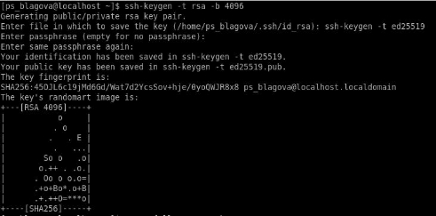

**РОССИЙСКИЙ УНИВЕРСИТЕТ ДРУЖБЫ НАРОДОВ ИМЕНИ ПАТРИСА ЛУМУМБЫ** 

**Факультет физико-математических и естественных наук Кафедра прикладной информатики и теории вероятностей** 

**ОТЧЕТ**  

**ПО ЛАБОРАТОРНОЙ РАБОТЕ № 2**

*дисциплина:  Операционные системы  *

Студент: Благова Полина  

Группа:   НПМбв-19 

**МОСКВА** 2023 г. 

**Цель работы:** 

- Изучить идеологию и применение средств контроля версий. 
- Освоить умения по работе с git.
- Создать ключи SSH и PGP. 

**Описание результатов выполнения задания:** 

\- Создать базовую конфигурацию для работы с git. Устанавливаю программный пакет для работы с git 

Рис. 1. Загрузка пакета git  

Провожу базовую настройку: имя владельца репозитория, почта владельца, настройка utf-8 в выводе сообщений git, создание master ветки, верификация и подпись коммитов, параметры autocrlf и savecrlf. 

Рис. 2. Базовая настройка git** 

- Создать ключ SSH.  

По алгоритму rsa с ключом размером 4096 бит и по алгоритму ed25519 

Рис. 3. Создание ключа ssh 

- Создать ключ PGP. 

Генерирую ключ. Из предложенных опций выбираю:  

- тип RSA and RSA;  
- размер 4096; 
  - выберите срок действия; значение по умолчанию— 0 (срок действия не 

истекает никогда). 

- GPG запросит личную информацию, которая сохранится в ключе:  
- Имя (не менее 5 символов). 
  - Адрес электронной почты.  
- При вводе email убедитесь, что он соответствует адресу, используемому на GitHub.  
- Комментарий. Можно ввести что угодно или нажать клавишу ввода, чтобы оставить это поле пустым. 

Рис. 4. Создание ключа pgp 

Рис. 5. Генерация ключа pgp 

Вывожу список ключей и копирую отпечаток приватного ключа: 

Рис. 6. Отпечаток приватного ключа. 

Вывожу публичный ключ и копирую его. 

Рис. 7. Публичный ключ gpg 

Ввожу публичный ключ в github. 

Рис. 8. Добавление публичного ключа gpg в github 

- Настроить подписи git.

Используя введёный email, указываю Git, чтобы применять его при подписи коммитов

Рис. 9. Настройка автоматических подписей коммитов git 

– 

- Создать локальный каталог для выполнения заданий по предмету Создаю репозиторий на своем аккаунте в github для заданий по предмету. 

Рис. 10. Репозиторий для выполнения заданий.  

**Выводы:** 

- Были изучены идеология и применение средств контроля версий. 
- Были освоены умения по работе с git.
- Были создать ключи SSH и PGP. 

**Контрольные вопросы:** 

1. **Что такое системы контроля версий (VCS) и для решения каких задач они предназначаются?**  

VCS применяются при работе нескольких человек над одним проектом. Обычно основное дерево проекта хранится в локальном или удалённом репозитории, к которому настроен доступ для участников проекта. При внесении изменений в содержание проекта система контроля версий позволяет их фиксировать, совмещать изменения, произведённые разными участниками проекта, производить откат к любой более ранней версии проекта, если это требуется.

2. **Объясните следующие понятия VCS и их отношения: хранилище, commit, история, рабочая копия.**  

Хранилище (репозиторий) – это система, которая обеспечивает хранение всех существовавших версий файлов. Commit - запись изменений. История - список предыдущих изменений. Рабочая копия – копия файла, с которой непосредственно ведётся работа (находится вне репозитория)  

С помощью коммитов изменения, внесённые в рабочую копию, заносятся в хранилище. 

3. **Что представляют собой и чем отличаются централизованные и децентрализованные VCS? Приведите примеры VCS каждого вида.**  

В случае с централизованной VCS репозиторий хранится на одном сервере, и  все разработчики работают с ним.  В децентрализованных их несколько, и они могут обмениваться изменениями между собой, а центрального репозитория может не существовать вообще. Среди классических (т.е. централизованных) VCS наиболее известны CVS, Subversion, а среди распределённых — Git, Bazaar, Mercurial. 

4. **Опишите действия с VCS при единоличной работе с хранилищем.**  Получить нужную версию проекта (рабочую копию), внести в неё необходимые изменения, сделать нужный коммит, создав при этом новую версию проекта (старые не удаляются). 
4. **Опишите порядок работы с общим хранилищем VCS.**  

Аналогично единоличной работе, но также можно объединить внесённые разными пользователями изменения, отменить изменения или заблокировать некоторые файлы для изменения, обеспечив привилегированный доступ конкретному разработчику. 

6. **Каковы основные задачи, решаемые инструментальным средством git?** Система контроля версий Git представляет собой набор программ командной строки. Доступ к ним можно получить из терминала посредством ввода команды git с различными опциями. Git позволяет создавать локальные репозитории и вносить в них изменения, а также работать с удалёнными репозиториями. 
6. **Назовите и дайте краткую характеристику командам git.**  
1) Создание основного дерева репозитория: git init 
1) Получение обновлений (изменений) текущего дерева из центрального репозитория: git pull 
1) Отправка всех произведённых изменений локального дерева в центральный репозиторий: git push  
1) Просмотр списка изменённых файлов в текущей директории: git status 
1) Просмотр текущих изменения: git diff  
1) Сохранение текущих изменений:  

а) Добавить все изменённые и/или созданные файлы и/или каталоги: git add .  

б) Добавить конкретные изменённые и/или созданные файлы и/или каталоги: git add имена\_файлов  

в) Удалить файл и/или каталог из индекса репозитория (при этом файл и/или каталог остаётся в локальной директории): git rm имена\_файлов  

7) Сохранение добавленных изменений:  

а) Сохранить все добавленные изменения и все изменённые файлы: git commit - am 'Описание коммита'  

б) Сохранить добавленные изменения с внесением комментария через встроенный редактор: git commit  

8) Создание новой ветки, базирующейся на текущей: git checkout -b имя\_ветки 
8) Переключение на некоторую ветку: git checkout имя\_ветки (при переключении на ветку, которой ещё нет в локальном репозитории, она будет создана и связана с удалённой)  
8) Отправка изменений конкретной ветки в центральный репозиторий: git push origin имя\_ветки  
8) Слияние ветки с текущим деревом: git merge --no-ff имя\_ветки  
8) Удаление ветки:  

а) Удаление локальной уже слитой с основным деревом ветки: git branch -d имя\_ветки  

б) Принудительное удаление локальной ветки: git branch -D имя\_ветки  

в) Удаление ветки с центрального репозитория: git push origin :имя\_ветки 

8. **Приведите примеры использования при работе с локальным и удалённым репозиториями.**  

Допустим, нужно добавить в проект новый файл file.txt Загрузим нужную версию из удалённого репозитория: git checkout last (last – имя нужной нам ветки) Добавим файл в локальный репозиторий: git add file.txt (файл лежит в том же каталоге, что и репозиторий) Сохраним изменения: git commit –am “file.txt was added” Отправим изменения в удалённый репозиторий: git push 

9. **Что такое и зачем могут быть нужны ветви (branches)?**  

СКВ могут поддерживать работу с несколькими версиями одного файла, сохраняя общую историю изменений до точки ветвления версий и собственные истории изменений каждой ветви. Это удобно при работе над одним проектом нескольких человек, или если вносимые на каждой из ветвей изменения будут разительно отличаться (например, создание программ с разным функционалом на базе одного интерфейса). 

10. **Как и зачем можно игнорировать некоторые файлы при commit** 

Во время работы над проектом так или иначе могут создаваться файлы, которые не требуется добавлять впоследствии в репозиторий. Например, временные файлы, создаваемые редакторами, или объектные файлы 
