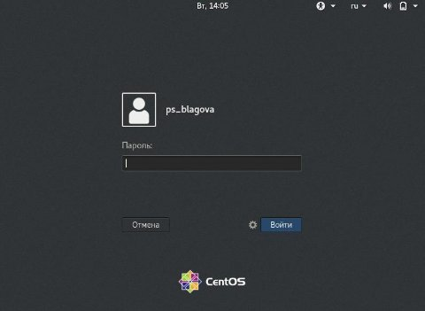
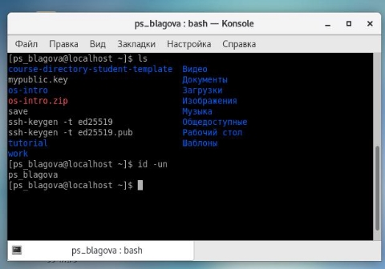
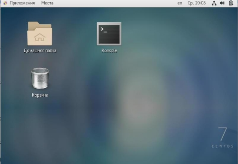
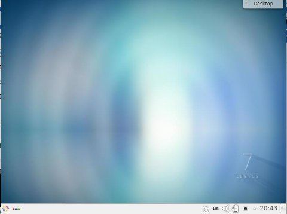
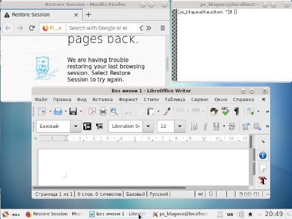
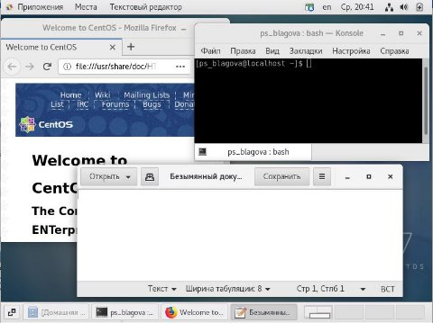

**РОССИЙСКИЙ УНИВЕРСИТЕТ ДРУЖБЫ НАРОДОВ ИМЕНИ ПАТРИСА ЛУМУМБЫ** 

**Факультет физико-математических и естественных наук Кафедра прикладной информатики и теории вероятностей** 

**ОТЧЕТ**  

**ПО ЛАБОРАТОРНОЙ РАБОТЕ № 4**

*дисциплина:  Операционные системы  *

Студент: Благова Полина  

Группа:   НПМбв-19 

**МОСКВА** 2023 г. 

**Цель работы:** 

Познакомиться с операционной системой Linux, получить практические навыки работы с консолью и некоторыми графическими менеджерами рабочих столов операционной системы. 

**Описание результатов выполнения задания:** 

1. Загрузить компьютер.  

Рис. 1. Скриншот загрузки ОС. 

2. Перейти на текстовую консоль. Сколько текстовых консолей доступно на вашем компьютере?  

С 1 до 6 доступно консолей из них 2 графические. 

Рис. 2. Текстовая консоль. 

3. Перемещаться между текстовыми консолями. Какие комбинации клавиш необходимо при этом нажимать?  

Рис. 3. Текстовая консоль 2. 

Рис. 4. Текстовая консоль 4. 

Надо нажимать Ctrl + Alt + F4, где вместо F4 можно переключаться с 1 до 6 консолей. 

4. Зарегистрироваться в текстовой консоли операционной системы. Какой логин вы при этом использовали? Какие символы отображаются при вводе пароля?  

Использовался логин: ps\_blagova 

При вводе пароля не отображаются никакие символы, кроме \_. 

5. Завершить консольный сеанс. Какую команду или комбинацию клавиш необходимо для этого использовать?  

Чтобы завершить консольный сеанс, зажимаем CTRL+D. 

6. Переключиться на графический интерфейс. Какую комбинацию клавиш для этого необходимо нажать?  

Для переключения к графическим интерфейсам я нажал Ctrl + Alt + F1 и Ctrl + Alt + F2, только два комбинации поддерживают графический интерфейс. 

7. Ознакомиться с менеджером рабочих столов. Как называется менеджер, запускаемый по умолчанию? Поочерёдно зарегистрироваться в разных графических менеджерах рабочих столов (GNOME, KDE, XFCE) и оконных менеджерах (Openbox). Продемонстрировать разницу между ними, сделав снимки экрана (скриншоты). Какие графические менеджеры установлены на вашем компьютере?  

Чтобы узнать менеджер рабочего стола ввожу: printf 'Desktop: %s\nSession: %s\n' "$XDG\_CURRENT\_DESKTOP" "$GDMSESSION" 

Рис. 5. Вывод названия менеджера рабочего стола. GNOME 

Графический менеджер Gnome. 

Рис. 6. Рабочий стол GNOME. 

У меня установлен еще один вариант ОС, с ним провожу те же манипуляции.  

Рис. 7. Вывод названия менеджера рабочего стола KDE. Графический менеджер KDE. 

Рис. 8. Рабочий стол KDE. 

8. Изучить список установленных программ. Обратить внимание на предпочтительные программы для разных применений. Запустите поочерёдно браузер, текстовой редактор, текстовой процессор, эмулятор консоли. Укажите названия программ 

Рис. 9. Предпочтительные программы KDE. 

Браузер: Internet Explorer 

Текстовый редактор: LibreOffice Writer 

Рис. 10. Предпочтительные программы GNOME. 

Браузер: Internet Explorer 

Текстовый редактор: LibreOffice Writer 

**Контрольные вопросы:** 

1. **Что такое компьютерный терминал? Есть ли, по вашему мнению, у него преимущества перед графическим интерфейсом?**  

Компьютерный терминал — устройство ввода/вывода, основные функции которого заключаются в занесении и отображении данных. У него есть преимущества, т. к. можно использовать лишь команды с клавиатуры. 

2. **Что такое входное имя пользователя?** 

Входное имя пользователя - это имя под которым пользователю дается id, а также для отслеживания действий пользователя. 

3. **В каком файле хранятся пароли пользователей? В каком виде они хранятся?** 

Изначально поле пароля содержало хеш пароля и использовалось для аутентификации. Однако из соображений безопасности все пароли были перенесены в специальный файл /etc/shadow, недоступный для чтения обычным пользователям. Поэтому в файле /etc/passwd поле password имеет значение x. 

4. **Где хранятся настройки пользовательских программ?**  

В домашнем каталоге 

5. **Какое входное имя у администратора ОС Unix?** 

Учётная запись пользователя с UID=0 называется root и присутствует в любой системе типа Linux. Пользователь root имеет права администратора и может выполнять любые действия в системе. 

6. **Имеет ли администратор доступ к настройкам пользователей?**  

Полномочия администратора не ограничены, поэтому он имеет доступ и к настройкам пользователей. 

7. **Каковы основные характеристики многопользовательской модели разграничения доступа?**  

Можно определить для пользователя черту которую не может переступить, то есть взглянуть системе под капотом. 

8. **Какую информацию кроме пароля и логина содержит учётная запись пользователя?**  

Кроме пароля и логина учётная запись пользователя содержит:  

- внутренний идентификатор пользователя (User ID);  
- идентификатор группы (Group ID);  
- анкетные данные пользователя (General Information);  
- домашний каталог (Home Dir);  
- указатель на программную оболочку (Shell). 
9. **Что такое UID и GID? Расшифруйте эти аббревиатуры.**  

User ID - внутренний идентификатор пользователя и Group ID - идентификатор группы. 

10. **Что такое GECOS?**  

Анкетные данные пользователя (General Information) являются необязательным параметром учётной записи и могут содержать реальное имя пользователя, адрес, телефон. 

11. **Что такое домашний каталог? Какие файлы хранятся в нем?**  

В домашнем каталоге пользователя хранятся данные (файлы) пользователя, настройки рабочего стола и других приложений. Содержимое домашнего каталога обычно не доступно другим пользователям с обычными правами и не влияет на работу и настройки рабочей среды других пользователей. 

12. **Как называется ваш домашний каталог?**  

Мой домашний каталог называется: ps\_blagova 

13. **Имеет ли администратор возможность изменить содержимое домашнего каталога пользователя?**  

Администратор имеет возможность изменить содержимое домашнего каталога пользователя. 

14. **Что хранится в файле /etc/passwd?**  

Учётные записи пользователей хранятся в файле /etc/passwd. 

15. **Как, просмотрев содержимое файла /etc/passwd, узнать, какие пользователи не смогут войти в систему?** 

Символ \* в поле password некоторой учётной записи в файле /etc/passwd означает, что пользователь не сможет войти в систему. 

16. **Что такое виртуальные консоли? Как вы думаете, что означает слово «виртуальный» в данном контексте?**  

Виртуальные консоли — реализация концепции многотерминальной работы в рамках одного устройства. Виртуальный означает, что можно выполнять много действий в одном окне со многими папками. 

17. **Зачем нужна программа getty?**  

getty (сокращение от get teletype) — программа для UNIX-подобных операционных систем, управляющая доступом к физическим и виртуальным терминалам (tty). 

18. **Что такое сеанс работы?**  

Процесс взаимодействия пользователя с системой с момента регистрации до выхода называется сеансом работы. 

19. **Что такое тулкит?**  

Toolkit (Tk, набор инструментов)— кроссплатформенная библиотека базовых элементов графического интерфейса, распространяемая с открытыми исходными текстами. 

20. **Какие основные тулкиты существуют в системе Unix** 

В системе Unix используются следующие основные тулкиты: 

- GTK+ (сокращение от GIMP Toolkit) — кроссплатформенная библиотека элементов интерфейса; 
- Qt — кросс-платформенный инструментарий разработки программного обеспечения на языке программирования C++. 

GTK+ состоит из двух компонентов: 

- GTK — содержит набор элементов пользовательского интерфейса (таких, как кнопка, список, поле для ввода текста и т. п.) для различных задач; 
- GDK — отвечает за вывод информации на экран, может использовать для 

этого X Window System, Linux Framebuffer, WinAPI. 

На основе GTK+ построены рабочие окружения GNOME, LXDE и Xfce. Естественно, эти тулкиты могут использоваться и за пределами «родных» десктопных окружений. 

Qt используется в среде KDE (Kool Desktop Environment). 
