**РОССИЙСКИЙ УНИВЕРСИТЕТ ДРУЖБЫ НАРОДОВ ИМЕНИ ПАТРИСА ЛУМУМБЫ** 

**Факультет физико-математических и естественных наук Кафедра прикладной информатики и теории вероятностей** 

**ОТЧЕТ**  

**ПО ЛАБОРАТОРНОЙ РАБОТЕ № 5** *дисциплина:  Операционные системы  *

Студент: Благова Полина  

Группа:   НПМбв-19 

**МОСКВА** 2023 г. 

**Цель работы:** 

Приобретение практических навыков взаимодействия пользователя с системой посредством командной строки.

**Описание результатов выполнения задания:** 

1. Определите полное имя вашего домашнего каталога. Далее относительно этого каталога будут выполняться последующие упражнения.  Имя моего домашнего каталога: ps\_blagova.  
1. Выполните следующие действия:  
1. Перейдите в каталог /tmp. 

Рис. 1. Переход в каталог tmp  

2. Выведите на экран содержимое каталога /tmp. Для этого используйте команду ls с различными опциями. Поясните разницу в выводимой на экран информации. 

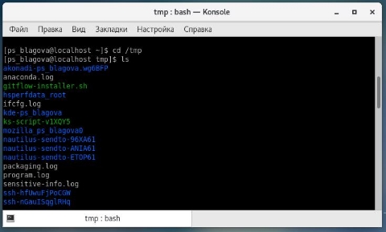

Рис. 2. Вывод содержимого каталога /tmp с помощью команды ls. 

- «ls» − выводится список каталогов и файлов, которые можно увидеть, «вручную» открыв каталог tmp  

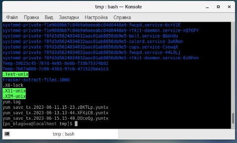

Рис. 3. Вывод содержимого каталога /tmp с помощью команды ls -a. 

- «ls -a» − к списку, описанному в предыдущем пункте, добавляются скрытые каталоги и файлы (их имена начинаются с точки)  

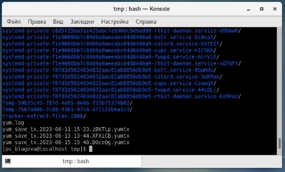

Рис. 4. Вывод содержимого каталога /tmp с помощью команды ls -F. 

- «ls -F» − с помощью этой команды получаем информацию о типах файлов  

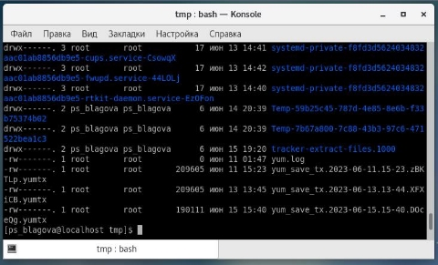

Рис. 5. Вывод содержимого каталога /tmp с помощью команды ls -l. 

- «ls -l» − получаем список каталогов и файлов, но уже с более подробной информацией о них  

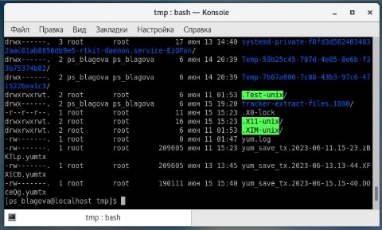

Рис. 6. Вывод содержимого каталога /tmp с помощью команды ls -alF. 

- «ls -alF» − данная команда отобразит список всех каталогов и файлов, в том числе и скрытых, с подробной информацией о них 
3. Определите, есть ли в каталоге /var/spool подкаталог с именем cron? 

Рис. 7. Подкаталоги каталога spool 

Перехожу в указанный каталог с помощью команды «cd /var/spool». Смотрю его 

содержимое, используя команду «ls». Данный подкаталог существует   

4. Перейдите в Ваш домашний каталог и выведите на экран его содержимое. Определите, кто является владельцем файлов и подкаталогов? 

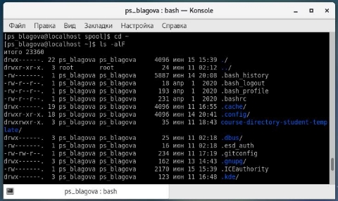

Рис. 8. Вывод владельцев каталогов и файлов домашнего каталога. 

Перехожу в свой домашний каталог с помощью команды «cd ~» и, используя команду «ls -alF», вывожу на экран его содержимое. Видно, что владельцем всех каталогов и файлов, кроме родительского каталога, является пользователь ps\_blagova из группы пользователей ps\_blagova.

3. Выполните следующие действия: 
1. В домашнем каталоге создайте новый каталог с именем newdir. 

Рис. 9. Создание каталога newdir. 

В домашнем каталоге создаю новый каталог newdir, используя команду «mkdir newdir».  

2. В каталоге ~/newdir создайте новый каталог с именем morefun. 

Рис. 10. Создание каталога с именем morefun. 

Создаю каталог morefun, используя команду «mkdir morefun». 

3. В домашнем каталоге создайте одной командой три новых каталога с именами letters, memos, misk. Затем удалите эти каталоги одной командой. 

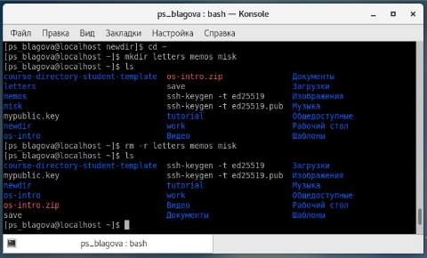

Рис. 11. Создание и удаление трех каталогов. 

Используя команду «mkdir letters memos misk», создаю в домашнем каталоге три новых. Далее с помощью команды «rm –r letters memos misk» удаляю созданные каталоги. 

4. Попробуйте удалить ранее созданный каталог ~/newdir командой rm. Проверьте, был ли каталог удалён. 

Рис. 12. Удаление каталога newdir. 

Удаляю каталог newdir. Получаю отказ в выполнении команды. 

5. Удалите каталог ~/newdir/morefun из домашнего каталога. Проверьте, был 

ли каталог удалён. 

Рис. 13. Удаление каталога newdir/morefun 

Удаляю каталог newdir/morefun, используя команду «rm –r newdir/morefun».   

4. С помощью команды man определите, какую опцию команды ls нужно использовать для просмотра содержимое не только указанного каталога, но и подкаталогов, входящих в него. 

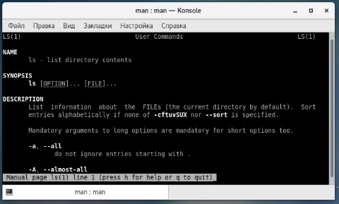

Рис. 14. Команда man ls.** 

5. С помощью команды man определите набор опций команды ls, позволяющий отсортировать по времени последнего изменения выводимый список содержимого каталога с развёрнутым описанием файлов. 

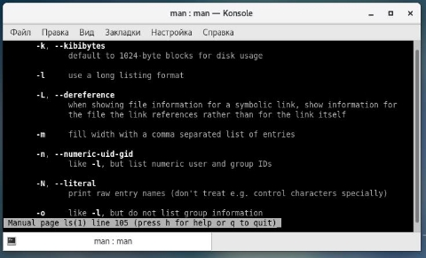

Рис. 15. Набор опций команды ls. 

6. Используйте команду man для просмотра описания следующих команд: cd, pwd, mkdir, rmdir, rm. Поясните основные опции этих команд. 

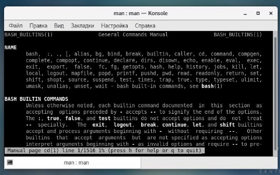

Рис. 16. Описание команды cd. 

Используя команды «man cd», «man pwd», «man mkdir», «man rmdir», «man rm», просматриваю описание соответствующих команд. Команда cd не имеет дополнительных опций. 

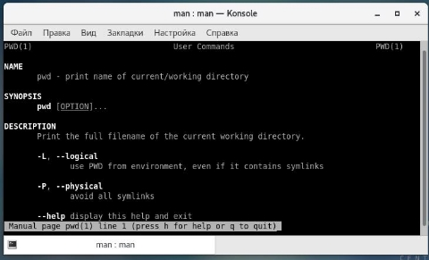

Рис. 17. Описание команды pwd. 

Команда pwd:  

- -L, --logical не разыменовывать символические ссылки. Если путь содержит символические ссылки, то выводить их без преобразования в исходный путь;  
- -P, --physical преобразовывать (отбрасывать символические ссылки) символические ссылки в исходные имена. Если путь содержит символические ссылки, то они будут преобразованы в названия исходных директорий, на которые они указывают;  
- --help показать справку по команде pwd;  
- --version показать версию утилиты pwd 

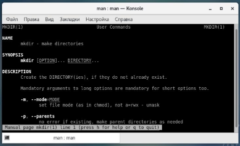

Рис. 18. Описание команды mkdir. 

Команда mkdir:  

- -m, --mode=MODE устанавливает права доступа для создаваемой директории. Синтаксис MODE такой же как у команды chmod;  
- -p, --parents создать все директории, которые указаны внутри пути. Если какая- либо директория существует, то предупреждение об этом не выводится;  
- -v, --verbose выводить сообщение о каждой создаваемой директории;  
- -z установить контекст SELinux для создаваемой директории по умолчанию;  
- --context[=CTX] установить контекст SELinux для создаваемой директории в значение CTX;  
- --help показать справку по команде mkdir;  
- --version показать версию утилиты mkdir 

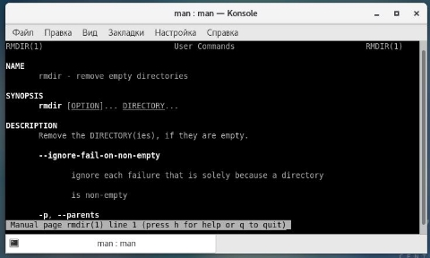

Рис. 19. Описание команды rmdir. 

Команда rmdir:  

- -p, --parents в этой опции каждый аргумент каталога обрабатывается как путь, из которого будут удалены все компоненты, если они уже пусты;  
- -v, --verbose отображение подробной информации для каждого обрабатываемого каталога;  
- --help показать справку по команде rmdir;  
- --version показать версию утилиты rmdi   

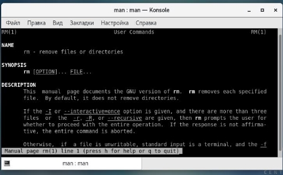

Рис. 20. Описание команды rm. 

Команда rm:  

- -f, --force игнорировать несуществующие файлы и аргументы. Никогда не выдавать запросы на подтверждение удаления;  
- -i выводить запрос на подтверждение удаления каждого файла;  
- -I выдать один запрос на подтверждение удаления всех файлов, если удаляется больше трех файлов или используется рекурсивное удаление. Опция применяется, как более «щадящая» версия опции –i; 
- --interactive[=WHEN] вместо WHEN можно использовать: never — никогда не выдавать запросы на подтверждение удаления. once — выводить запрос один раз (аналог опции -I) always — выводить запрос всегда (аналог опции -i);  
- --one-file-system во время рекурсивного удаления пропускать директории, которые находятся на других файловых системах;  
- --no-preserve-root если в качестве директории для удаления задан корневой раздел /, то считать, что это обычная директория и начать выполнять удаление; 
7. Используя информацию, полученную при помощи команды history, выполните модификацию и исполнение нескольких команд из буфера команд.

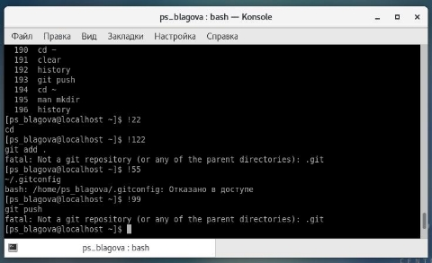

Рис. 21. История команд. 

Вывожу историю команд с помощью команды history. Далее, используя команды, «!122» и «!22», «!155» и «!199». 

**Вывод:** 

Были получены практические навыки взаимодействия пользователя с системой посредством командной строки.

**Контрольные вопросы:** 

1. **Что такое командная строка?** 

Командная строка – специальная программа, позволяющая управлять операционной системой при помощи текстовых команд, вводимых в окне приложения. 

2. **При помощи какой команды можно определить абсолютный путь текущего каталога? Приведите пример.** 

Для определения абсолютного пути к текущему каталогу используется команда pwd (print working directory). Например, команда «pwd» в моем домашнем каталоге выведет: /home/ps\_blagova 

3. **При помощи какой команды и каких опций можно определить только тип файлов и их имена в текущем каталоге? Приведите примеры.**  

Команда «ls -F» (или «ls -aF», тогда появятся еще скрытые файлы) выведет имена файлов в текущем каталоге и их типы. Тип каталога обозначается /, тип исполняемого файла обозначается \*, тип ссылки обозначается @. 

4. **Какие файлы считаются скрытыми? Как получить информацию о скрытых файлах? Приведите примеры.**  

Имена скрытых файлов начинаются с точки. Эти файлы в операционной системе скрыты от просмотра и обычно используются для настройки рабочей среды. Для того, чтобы отобразить имена скрытых файлов, необходимо использовать команду «ls –a».   

5. **При помощи каких команд можно удалить файл и каталог? Можно ли это сделать одной и той же командой? Приведите примеры.**  

Команда rm используется для удаления файлов и/или каталогов. Команда rm -i выдает запрос подтверждения на удаление файла. Команда rm -r необходима, чтобы удалить каталог, содержащий файлы. Без указания этой опции команда не будет выполняться. Если каталог пуст, то можно воспользоваться командой rmdir. Если удаляемый каталог содержит файлы, то команда не будет выполнена 

- нужно использовать «rm -r имя\_каталога». Таким образом, каталог, не содержащий файлов, можно удалить и командой rm, и командой rmdir. Файл командой rmdir удалить нельзя. 
6. **Как определить, какие команды выполнил пользователь в сеансе работы?**  

Чтобы определить, какие команды выполнил пользователь в сеансе работы, необходимо воспользоваться командой «history». 

7. **Каким образом можно исправить и запустить на выполнение команду, которую пользователь уже использовал в сеансе работы? Приведите примеры.**  

Чтобы исправить или запустить на выполнение команду, которую пользователь уже использовал в сеансе работы, необходимо: в первом случае: воспользоваться конструкцией !:s//, во втором случае: !. 

8. **Можно ли в одной строке записать несколько команд? Если да, то как? Приведите примеры.**  

Чтобы записать в одной строке несколько команд, необходимо между ними поставить ; . Например, «cd /tmp; ls». 

9. **Что такое символ экранирования? Приведите примеры использования этого символа.**  

Символ обратного слэша \ позволяет использовать управляющие символы ( ".", "/", "$", "\*", "[", "]", "^", "&") без их интерпретации командной оболочкой; процедура добавления данного символа перед управляющими символами называется экранированием символов. Например, команда «ls newdir/morefun» отобразит содержимое каталога newdir/morefun. 

10. **Какая информация выводится на экран о файлах и каталогах, если используется опция l в команде ls?**  

Команда «ls -l» отображает список каталогов и файлов с подробной информацией о них (тип файла, право доступа, число ссылок, владелец, размер, дата последней ревизии, имя файла или каталога). 

11. **Что такое относительный путь к файлу? Приведите примеры использования относительного и абсолютного пути при выполнении какой-либо команды.**  

Полный, абсолютный путь от корня файловой системы – этот путь начинается от корня "/" и описывает весь путь к файлу или каталогу; Относительный путь – это путь к файлу относительно текущего каталога (каталога, где находится пользователь). Например, «cd /newdir/morefun» – абсолютный путь, «cd newdir» 

- относительный путь. 
12. **Как получить информацию об интересующей вас команде?**  

Чтобы получить необходимую информацию о команде, необходимо воспользоваться конструкцией man [имя\_команды], либо использовать опцию help, которая предусмотрена для некоторых команд. 

13. **Какая клавиша или комбинация клавиш служит для автоматического дополнения вводимых команд** 

Для автоматического дополнения вводимых команд служит клавиша Tab. Вывод: В ходе выполнения данной лабораторной работы я приобрела практические навыки взаимодействия с системой посредством командной строки. 
