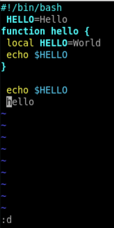

**РОССИЙСКИЙ УНИВЕРСИТЕТ ДРУЖБЫ НАРОДОВ
ИМЕНИ ПАТРИСА ЛУМУМБЫ**

**Факультет физико-математических и естественных наук**

**Кафедра прикладной информатики и теории вероятностей**

**ОТЧЕТ** 

**ПО ЛАБОРАТОРНОЙ РАБОТЕ № 	9**

*дисциплина:Операционные системы*		

Студент: Благова Полина 

`	`Группа: НПМбв-19

**МОСКВА**

2023г.

**Цель работы:**

Познакомиться с операционной системой Linux. Получить практические навыки работы с редактором vi, установленным по умолчанию практически во всех дистрибутивах.

**Описание результатов выполнения задания:**

Задание 1. Создание нового файла с использованием vi 

` `1. Создайте каталог с именем ~/work/os/lab06. 

Создаю каталог, используя команду «mkdir -p work/os/lab06».

2\. Перейдите во вновь созданный каталог.

Перехожу командой «cd work/os/lab06» в созданный каталог

` `

3\. Вызовите vi и создайте файл hello.sh

` `vi hello.sh 

Вызываю vi и создаю файл hello.sh с помощью команды «vi hello.sh»

4\. Нажмите клавишу i и вводите следующий текст. 

*#!/bin/bash*

` `HELL=Hello 

**function** hello {

` `LOCAL HELLO=World

` `echo $HELLO 

}

` `echo $HELLO

` `hello 

Нажимаю клавишу «i» и ввожу текст

5\. Нажмите клавишу Esc для перехода в командный режим после завершения ввода текста. 

6\. Нажмите : для перехода в режим последней строки и внизу вашего экрана появится приглашение в виде двоеточия. 

7\. Нажмите w (записать) и q (выйти), а затем нажмите клавишу Enter для сохранения вашего текста и завершения работы.

8\. Сделайте файл исполняемым chmod +x hello.sh

Задание 2. Редактирование существующего файла 

1\. Вызовите vi на редактирование файла vi~/work/os/lab06/hello.sh 

2\. Установите курсор в конец слова HELL второй строки. 

3\. Перейдите в режим вставки и замените на HELLO. Нажмите Esc для возврата в командный режим. 

4\. Установите курсор на четвертую строку и сотрите слово LOCAL. 

5\. Перейдите в режим вставки и наберите следующий текст: local, нажмите Esc для возврата в командный режим. 

6\. Установите курсор на последней строке файла. Вставьте после неё строку, содержащую следующий текст: echo $HELLO. 

7\. Нажмите Esc для перехода в командный режим. 

8\. Удалите последнюю строку. 

9\. Введите команду отмены изменений u для отмены последней команды. 

10\. Введите символ : для перехода в режим последней строки. Запишите произведённые изменения и выйдите из vi

` `

**Вывод:**

Было ознакомление с операционной системой Linux. Были получены практические навыки работы с редактором vi, установленным по умолчанию практически во всех дистрибутивах.

**Контрольные вопросы:**

1. **Дайте краткую характеристику режимам работы редактора vi.** 

Редактор vi имеет три режима работы:

- командный режим − предназначен для ввода команд редактирования и навигации по редактируемому файлу;
- режим вставки − предназначен для ввода содержания редактируемого файла;
- режим последней (или командной) строки − используется для записи изменений в файл и выхода из редактора.
1. **Как выйти из редактора, не сохраняя произведённые изменения?** 

Чтобы выйти из редактора, не сохраняя произведённые изменения, нужно в режиме командной строки нажать клавиши : , q , ! 

1. **Назовите и дайте краткую характеристику командам позиционирования.** 

Команды позиционирования:

- «0» (ноль) − переход в начало строки;
- «$» − переход в конец строки;
- «G» − переход в конец файла;
- n«G» − переход на строку с номером n.

1. **Что для редактора vi является словом?** 

При использовании прописных W и B под разделителями понимаются только пробел, табуляция и возврат каретки. При использовании строчных w и b под разделителями понимаются также любые знаки пунктуации.

1. **Каким образом из любого места редактируемого файла перейти в начало (конец) файла?** 

Чтобы из любого места редактируемого файла перейти в начало (конец) файла, нужно в режиме командной строки нажать клавиши 1 , G , (G).

1. **Назовите и дайте краткую характеристику основным группам команд редактирования.** 

Команды редактирования:

Вставка текста

- «а» − вставить текст после курсора;
- «А» − вставить текст в конец строки;
- «i» − вставить текст перед курсором;
- n «i» − вставить текст n раз;
- «I» − вставить текст в начало строки.

Вставка строки

- «о» − вставить строку под курсором;
- «О» − вставить строку над курсором.

Удаление текста

- «x» − удалить один символ в буфер;
- «d» «w» − удалить одно слово в буфер;
- «d» «$» − удалить в буфер текст от курсора до конца строки;
- «d» «0» − удалить в буфер текст от начала строки до позиции курсора;
- «d» «d» − удалить в буфер одну строку;
- n «d» «d» − удалить в буфер n строк.

Отмена и повтор произведённых изменений

- «u» − отменить последнее изменение;
- «.» − повторить последнее изменение.

Копирование текста в буфер

- «Y» − скопировать строку в буфер;
- n «Y» − скопировать n строк в буфер;
- «y» «w» − скопировать слово в буфер. Вставка текста из буфера
- «p» − вставить текст из буфера после курсора;
- «P» − вставить текст из буфера перед курсором. Замена текста
- «c» «w» − заменить слово;
- n «c» «w» − заменить n слов;
- «c» «$» − заменить текст от курсора до конца строки;
- «r» − заменить слово;
- «R» − заменить текст. Поиск текста
- «/» текст − произвести поиск вперёд по тексту указанной строки символов текст;
- «?» текст − произвести поиск назад по тексту указанной строки символов текст. Копирование и перемещение текста
- «:» n,m «d» – удалить строки с n по m;
- «:» i,j «m» k – переместить строки с i по j, начиная со строки k;
- «:» i,j «t» k – копировать строки с i по j в строку k;
- «:» i,j «w» имя-файла – записать строки с i по j в файл с именем имя-файла

1. **Необходимо заполнить строку символами $. Каковы ваши действия?**

Чтобы заполнить строку символами $, необходимо для начала перейти на эту строку, нажав клавиши n G, где n – номер строки, далее нажать «0» для перехода в начало строки. 

Теперь необходимо нажать c $, чтобы заменить текст от курсора до конца строки, и ввести символы $.

1. ` `**Как отменить некорректное действие, связанное с процессом редактирования?** 

Чтобы отменить по одному предыдущему действию последовательно, необходимо нажать «u». Чтобы отменить все изменения, произведённые со времени последней записи, нужно нажать «:» «e» «!».

1. **Назовите и дайте характеристику основным группам команд режима последней строки.** 

Команды редактирования в режиме командной строки

Копирование и перемещение текста

- «:» n,m «d» − удалить строки с n по m;
- «:» i,j «m» k − переместить строки с i по j, начиная со строки k;
- «:» i,j «t» k − копировать строки с i по j в строку k;
- «:» i,j «w» имя-файла − записать строки с i по j в файл с именем имя-файла.

Запись в файл и выход из редактора

- «:» «w» − записать изменённый текст в файл, не выходя из vi;
- «:» «w» имя-файла − записать изменённый текст в новый файл с именем имя-файла;
- «:» «w» «!» имя-файла − записать изменённый текст в файл с именем имя-файла;
- «:» «w» «q» − записать изменения в файл и выйти из vi;
- «:» «q» − выйти из редактора vi;
- «:» «q» «!» − выйти из редактора без записи;
- «:» «e» «!» − вернуться в командный режим, отменив все изменения, произведённые со времени последней записи.

Опции Опции редактора vi позволяют настроить рабочую среду. Для задания опций используется команда set (в режиме последней строки):

- «:» set all − вывести полный список опций;
- «:» set nu − вывести номера строк;
- «:» set list − вывести невидимые символы;
- «:» set ic − не учитывать при поиске, является ли символ прописным или строчным. Если вы хотите отказаться от использования опции, то в команде setперед именем опции надо поставить no.

1. ` `**Как определить, не перемещая курсора, позицию, в которой заканчивается строка?** 

Чтобы определить, не перемещая курсора, позицию, в которой заканчивается строка, нужно в командном режиме находясь на нужной строке нажать «$» и посмотреть на число после запятой в правом нижнем углу экрана

1. ` `**Выполните анализ опций редактора vi (сколько их, как узнать их назначение и т.д.).** 

Опции редактора vi позволяют настроить рабочую среду. Для задания опций используется команда set (в режиме командной строки). Если вы хотите отказаться от использования опции, то в команде set перед именем опции надо поставить no. Чтобы просмотреть опции редактора vi, необходимо нажать «:» set all Нажав «:» help “название\_опции”, можно узнать назначение конкретной опции

1. ` `**Как определить режим работы редактора vi?** 

В режиме командной строки внизу редактора присутствует «:», в режиме ввода – «-- ВСТАВКА --», в командном режиме внизу ничего нет.

1. ` `**Постройте граф взаимосвязи режимов работы редактора vi**

